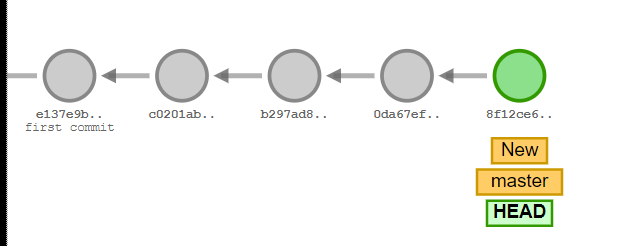
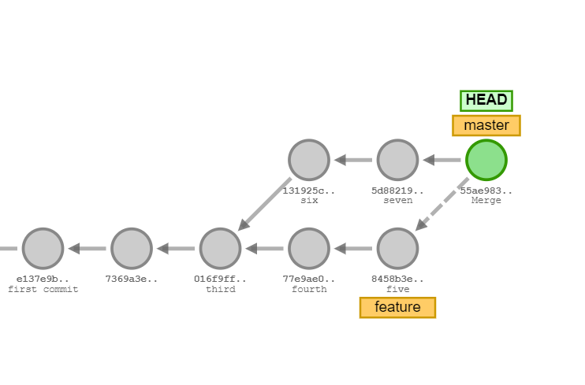

## What is Git?
<p>Git is a tool/software that is used to control the version of a system </p>

## Why do we need git ?
- Version Control System
- Keep track of Changes
- Collaboration on Project

## Other Version Control System and Repository
1. GitLab
2. BeanStalk
3. PerForce
4. BitBucket

``` Over 70% Developer use Git !```

## What is Github?
<p>Github is Repository that provides Graphical user inteface.</p>

### Difference between Git and Github:
|Github | Git |  
|-------|------ |  
|Service | Tool/Software |  
|Repository/folder/source code | Change Control, Version Control|  
|Provides GUI Interface | Provides CLI Interface |  
|Maintained on cloud/web | Installed and maintained locally | 

### More about Git and Github:
#### GitHub: 
- More than 56 million users
- Founded in 2008
- Owned by Microsoft

#### Git:
- Released : April 7, 2005
- Python, C, C++, Perl
- Linus Towards  

## Git Setup and Configuration
<p>To download the git in your device click download</p>
[download]('https://git-scm.com/downloads')

__To show git version__  
```git --version```   
__For Git Configuration__:   
UserName:  
```git config --global user.name "UserName"```   
Email:  
```git config --global user.email "Email"```   
To see the UserName what you have set in the terminal:   
```git config user.name```   
To see the Email what you have set in the terminal:   
```git config user.email```  
<p>You can change the username and email if you need to change according to config</p> 
  
__How can we push a file/folder in github from git__   
```working Directory -> staging area -> local repo. -> remote repo.```   
```Test-area -> git add -> git commit-> git push```


## __Git Command__
### To show Which directory we are working:   
```pwd```
### To see all files:   
```ls```
### Create make dictionary/folder
```mkdir folderName```
### To see all files with hidden files
``` ls -a ```
### To initialize the git in your terminal:
``` git init ```
### Create new file  
```touch fileName```
### Open the file in windows
```start fileName```
### Open the file in linux
``` open fileName ```
### To see git status
```git status ```  
### Delete a folder: 
``` rm -rf “folder name” ```
## __To go Stagging area from working Directory__
From Untracked to tracked file:
- git add FolderName
- git add - A (stage all changed file in directory and sub-directories)
- git add . (stage all changed file in directory but not sub-directories)
- git add *. (directory wildcard)

```For restore information -> git restore fileName```

## From Staging to unstaging add:
```git rm --cached fileName```
## To see the difference between unstaging and staging area
```git diff ``` 
## Staging area to local Repository...
### How to make a git commit:
```git commit -m "just write text what about you do or why you want to commit" ```
### To see all history
```git log ```
### Instead of git log, to see id and commits
``` git log --oneline ```
### Combine of Tracking/stagging and create local repository
``` git add . && git commit -m "message" ```
### To open folder in Visual Studio code
```code .```
### Move one commit to another commit 
``` git checkout commitName ```
### To delete all files from local Repository. to working directory
``` git reset HEAD^ ```
### From Local Repository to stagging area
``` git reset --soft HEAD^ ```
## Remote Repository
### To check, the remote repository exist or not
``` git remote ```
### To move from local repo. to remote repo.
``` git remote add origin "link of remote repo." ```
### To push on master branch
``` git push -u origin master ```
### For Pull Request
``` git pull / git pull origin master ```

## __Gitignore File__ 
<p>.gitignore refers to sectret things that we do not want to share.</p>   

### Example
- test.txt
- .env
- *.txt (all txt file)
- !main.txt (not main.txt)
- text?.txt (text1, text2, text3 ....... .txt)
- temp / (will be ignore inside all file in temp folder) 

__if you write above list in .gitignore file, then these file will be hidden in your remote repository__.

## __Branch__
Branch is a new and separate branch of the master repo.   
In a big project,we separate the tasks and features and create branch so editing in the new branch does not affect the master branch.

``` Branch -> Reviews -> Testing  -> Merge ```
### Necessary Commands for Branch
---
### To check, how many branch have your repo. ---
``` git branch ```
### To check remote branch 
``` git branch -r ```
### To check local and remote branch
``` git branch -a ```
### To create New Branch
``` git branch "Branch Name" ```
### Move/switch to new Branch
``` git checkout "Branch Name" ```  
### Asterisk symbol(*)
```* represents current branch ``` 
### Delete new branch 
``` git branch -d "BranchName" ``` 
### Merge with Master Branch
``` git merge "BranchName" ```
### Create and Checkout branch 
``` git checkout -b "branchName" ```
### Push New branch in github
```git push -u origin "BranchName" ```

### Merge in git from github
``` git pull ```


## 2-way merge / First forward Merge
Example - 
```
- git commit
- git commit
- git branch feature1
- git checkout feature1
- git commit
- git commit
- git checkout master
- git merge feature1
```



## 3-way Merge
```
- git commit -m “second commit”
- git commit -m “third commit”
- git branch feature
- git checkout feature
- git commit -m “four commit”
- git commit -m “five commit”
- git checkout master
- git commit -m “six commit”
- git commit -m “seven commit”
- git merge feature

```




## Merge Conflict
At a time different merge do from different branch -> create conflict
and we can resolve the ultimate conflict

## Fork 
- A Fork is a copy of a repository. This is useful when you want to contribute to someone else’s project or start your own project based on theirs.
- Forking own repo is not possible.
- Fork is not a command, use github and fork.

```Fork -> git clone -> make pull request```

## Clone
``` git clone HTTPs links ```


